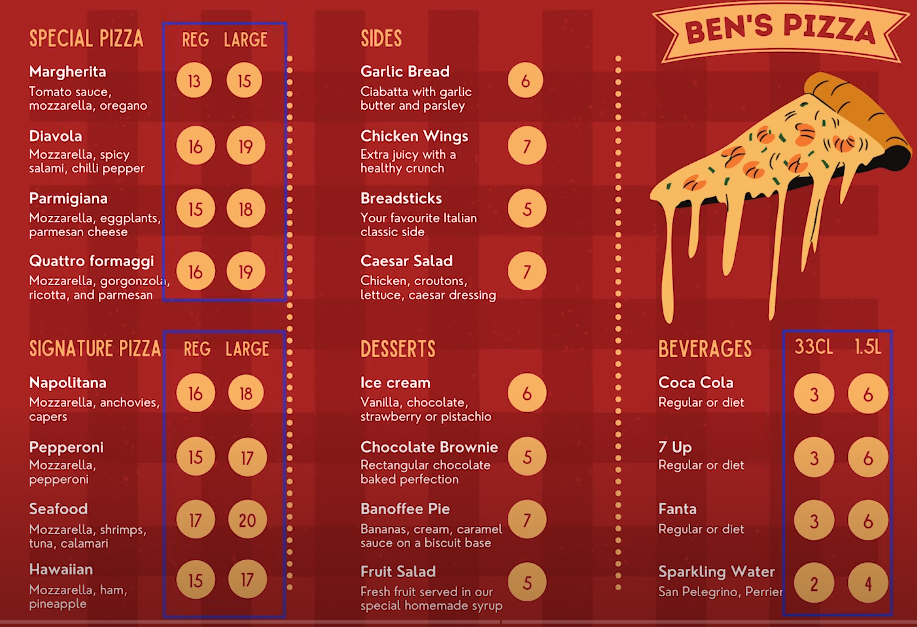
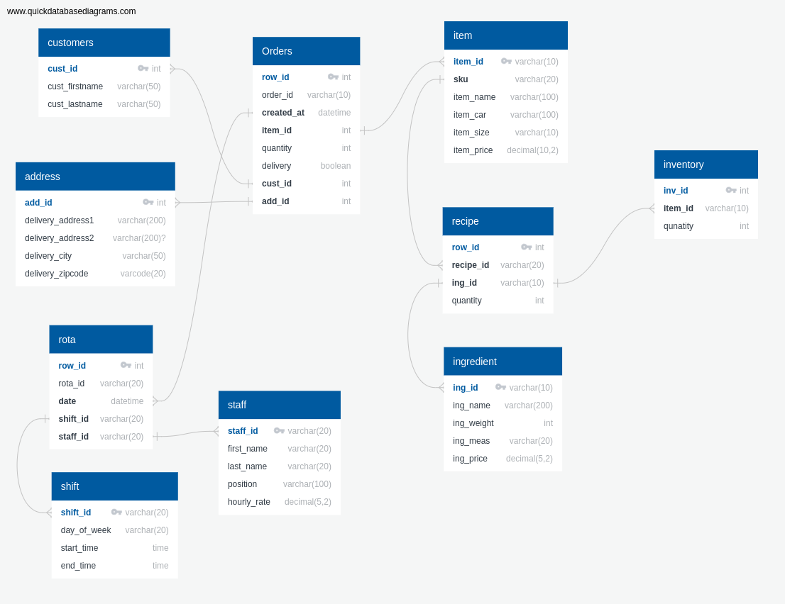
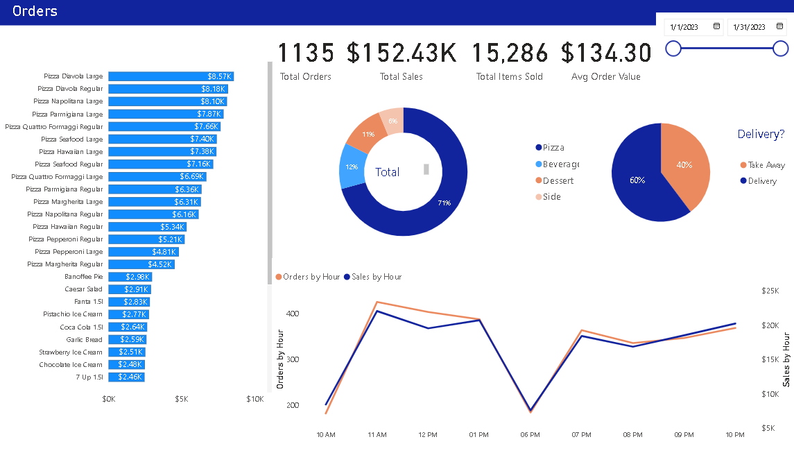
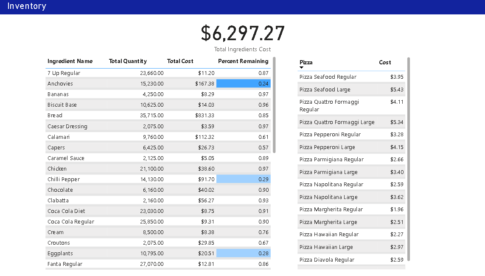
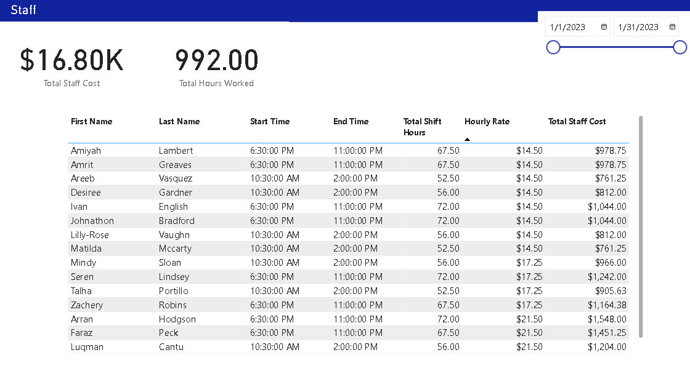

# Ben's Pizzeria (Data Modeling and Analysis Portfolio Project SQL|Power BI)

## Client : Ben's Pizzeria 
New Pizzeria Take Out or Delivery Only.

## Pamphlet

## Task
1. Design, Build and Normalize a Database Model.
2. Import the data.
3. Capture all of the Informatio through Power BI.

## Main Areas of Focus
1. Orders
2. Stock Control
3. Staff

## Steps for Database Modeling
1. Spec out all of the data we want to collect.
2. Define table relation
3. Normalize

## Dashboards

### Order Activity

This dashboard provides insights into order trends, such as total orders, sales, items, average order value, sales by category, top-selling items, orders by the hour, sales by hour, orders by address, and orders by delivery/pick-up.
  

### Inventory Management

This dashboard tracks inventory usage and costs, as well as the calculated cost of pizzas. It also shows the percentage of stock remaining for each ingredient.

### Staff Management

This dashboard monitors staff costs, hours worked, and the cost per staff member.

## Implementation

Data Modeling : QuickDBD
SQL : MySQL
BI Dashboards : Power BI

## Result
Ben can these dashboards which are provided with valuable insights into his business performace to make informed decisions about things like pricing, staff and inventory management.
